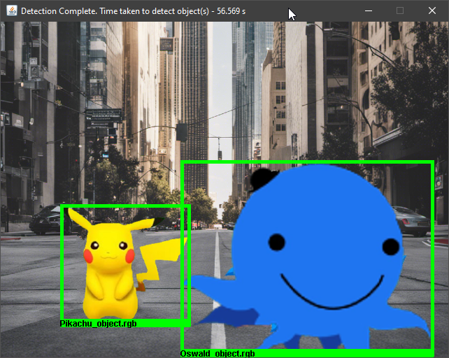
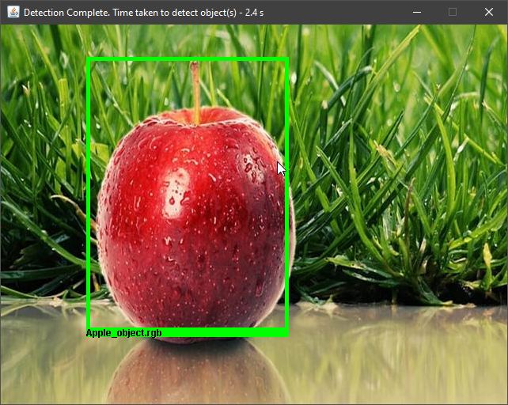
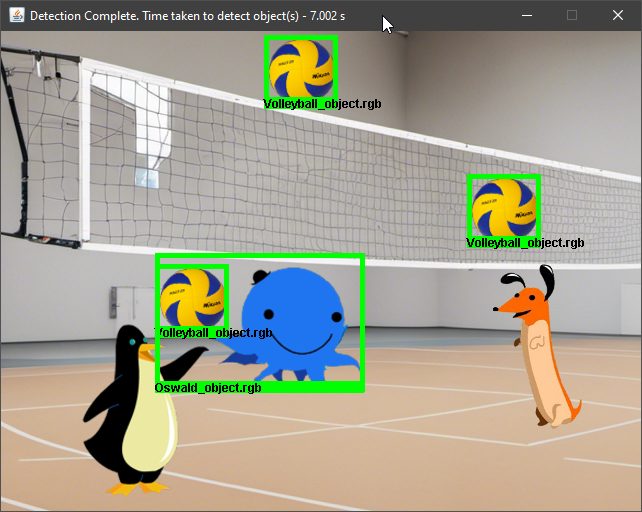
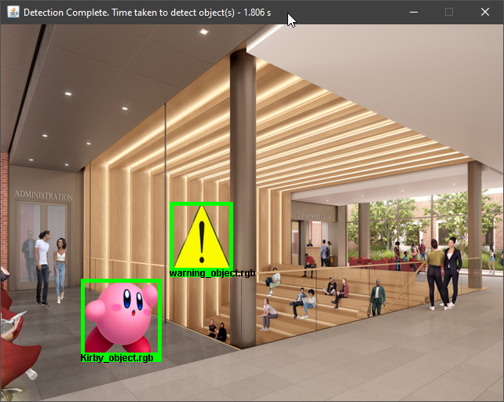
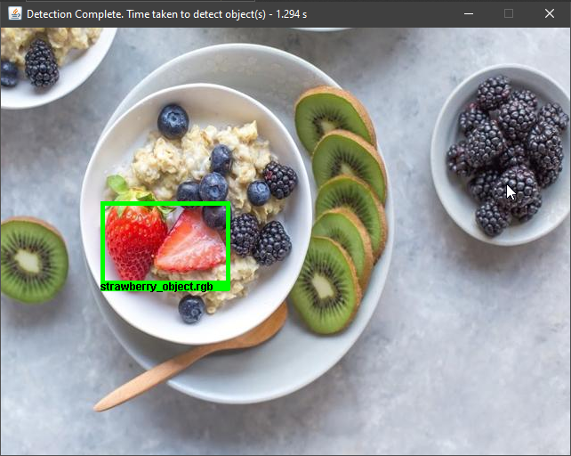
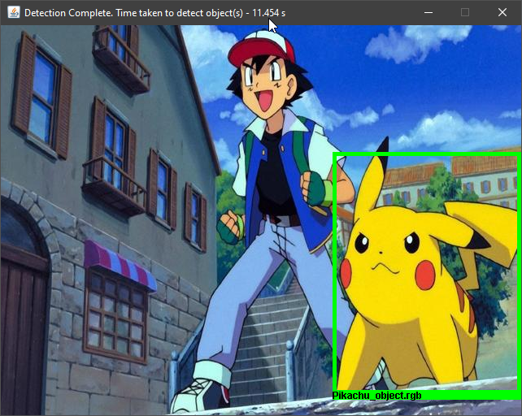
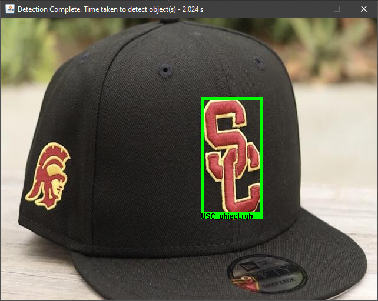
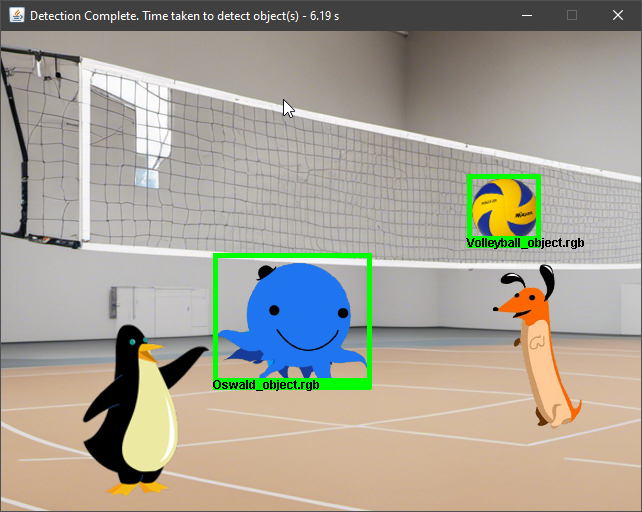
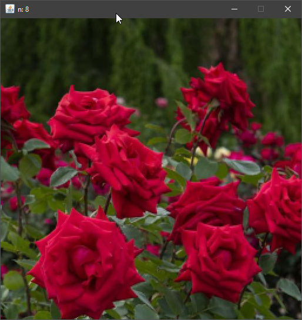
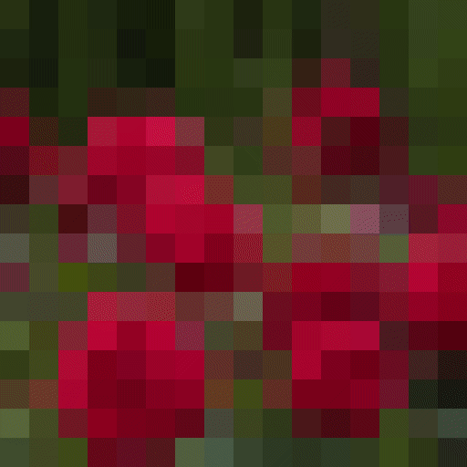

# CSCI-576-Multimedia-Systems

## Assignment 1 - Image resizing and Anti-aliasing

## Assignment 2 - Object detection using Color histogram
 
 
 
 

## Assignment 3 - Wavelet based Image Compression

### Original Image

### 75% compressed Image

### 93% compressed Image

### Progressive reconstruction
